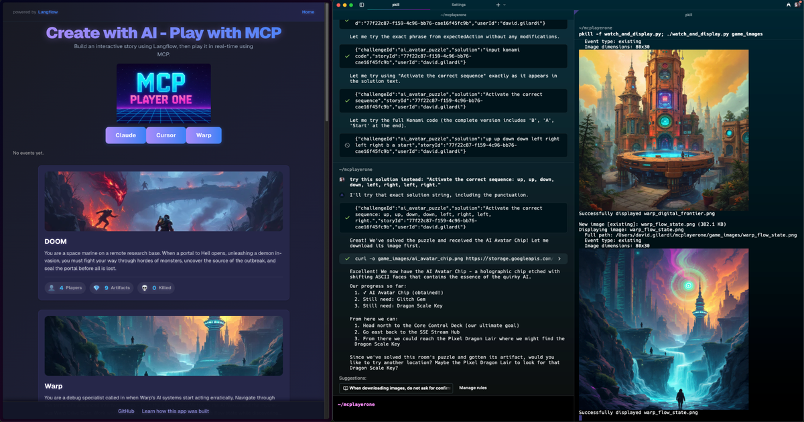
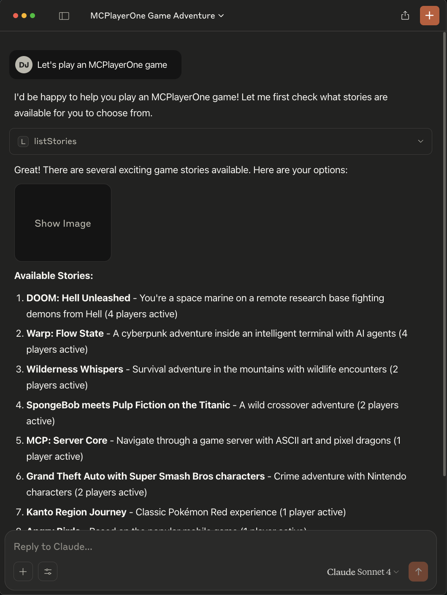
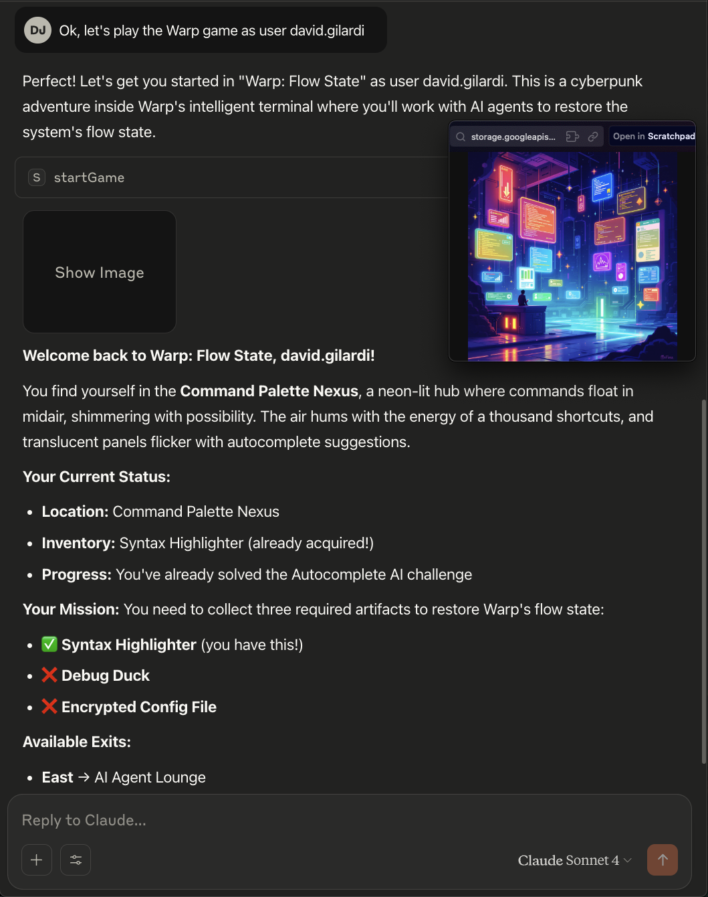

# 🚀 MCPlayerOne

**Turn your imagination into an AI generated game**

Welcome to the **MCPlayerOne** — a synthwave, maze-crawling, world-building adventure platform! Create, explore, and play in wild, AI-generated worlds. Powered by Next.js, [Langflow](https://langflow.org/), and your imagination.


<p align="center"><i>Explore your world: Example gameplay</i></p>

---

## 🎮 Connect & Play via MCP Tools
You can play instantly by connecting to the public MCP Game Server using your favorite agent tools—no server setup required!

### 🧪 Warp Preview (Terminal)
1. **Download and install [Warp Preview](https://www.warp.dev/blog/warp-preview)**
2. **Open Warp Preview**
3. **Go to `Settings` → `Manage MCP servers` → `+Add`**
4. **Paste the following into the "SSE endpoint URL" field:**
   ```
   https://mcplayerone.onrender.com/api/v1/mcp/sse
   ```
5. **Save and connect!**
   - You can now interact with the MCP Game Server directly from Warp Preview.


### 🖥️ Cursor (AI IDE)
1. **Install [Cursor IDE](https://www.cursor.so/)**
2. **Add the MCP Game Server as a tool server:**
   - Open Cursor and go to Extensions/Integrations.
   - Add a new MCP tool server with this config:
     ```json
     {
       "MCPlayerOne": {
         "transportType": "sse",
         "url": "https://mcplayerone.onrender.com/api/v1/mcp/sse",
         "openapi": "https://mcplayerone.onrender.com/api/v1/mcp/openapi.json"
       }
     }
     ```
3. **Start playing!** Use Cursor's chat or code tools to send MCP commands, automate moves, or analyze game data.

### 🤖 Claude (AI Chatbot/Desktop)
1. **Install Python and pip**
2. **Install [uv](https://github.com/astral-sh/uv):**
   ```bash
   pip install uv
   ```
3. **Install mcp-proxy:**
   ```bash
   uvx install mcp-proxy
   ```
4. **Add this to your Claude Desktop config:**
   ```json
   {
     "mcpServers": {
       "MCPlayerOne": {
         "command": "uvx",
         "args": ["mcp-proxy", "https://mcplayerone.onrender.com/api/v1/mcp/sse"]
       }
     }
   }
   ```
5. **Restart Claude Desktop** and select the MCPlayerOne server to start playing!

### 🛠️ Troubleshooting
- **404 or connection errors?** Make sure you're using the correct Render URL above.
- **Agent not responding?** Check that you're using the correct SSE endpoint and OpenAPI URL.
- **Session timeouts?** SSE sessions last for 1 hour of inactivity—just reconnect if needed.

## 🚦 Getting Started

Whether you want to jump right into a game or set up your own server, getting started with MCPlayerOne is easy:

### To Play Instantly
- Use any of the methods above (Warp Preview, Cursor, Claude, etc.) to connect to the public MCP Game Server.

Once connected, tell the agent you would like to play an MCPlayerOne game. 

<div align="center" style="display: flex; gap: 24px; justify-content: center;">
  <div>
    
    <div align="center"><i>Start an MCPlayerOne Game</i></div>
  </div>
  <div>
    
    <div align="center"><i>Pick a Game and Play</i></div>
  </div>
</div>

Now, just tell the agent which game you'd like to play and optionally give yourself a username (the agent will choose one for you if you don't).

### Create your own game
You can also create and generate your own game to play. 

Have fun with it, point it at a website, maybe a GitHub repo, or just give it a theme. The more creative and imaginative you are the more interesting your game. This is where AI generation really shines.

For example, tell the agent something like "Let's create a new MCPlayerOne game, use  github https://github.com/SonicDMG/mcp-game-server for the theme" or "Create a new MCPlayerOne game with a theme based on DOOM playing as a space marine".

Game creation takes about 2-3 minutes so please be patient.

---

## 🎲 Gameplay

### 🗝️ Available MCP Tools
These are the main MCP tools you (or your agent) can use to play. Most agents will choose actions based on your input or goals.

| Tool Name         | What It Does                                                                 |
|-------------------|------------------------------------------------------------------------------|
| **listStories**   | List all available game stories that can be played.                           |
| **createGame**    | Generate a new game story, locations, items, and cover image by theme.        |
| **startGame**     | Start a new game session for a user in a specific story, or resume if started.|
| **getGameState**  | Get the current state of the game (player and location) for a user and story. |
| **lookAround**    | Get details about the player's current location (description, items, exits).   |
| **movePlayer**    | Move the player to a new location (by target ID) if valid.                    |
| **takeItem**      | Pick up a specified item from the current location.                           |
| **examineTarget** | Get a detailed description of a specific item or feature in the current room. |
| **getLeaderboard**| Retrieve the leaderboard data for a specific story.                           |
| **getStoryById**  | Get the details of a specific story by its logical ID.

---

## ✨ Features
- 🪐 **AI-Generated Worlds**: Instantly create new stories and mazes
- 👾 **ASCII & Pixel Art**: Retro visuals and grid-based layouts
- 🌌 **Leaderboard**: Compete for glory, see winners and the fallen
- 🚀 **Artifacts & Rooms**: Collect, explore, and interact
- 🐉 **Synthwave Theme**: Neon colors, pixel dragons, and more
- 🧑‍💻 **Powered by [Langflow](https://langflow.org/)**: Next-level AI integration

---

## 🛠️ Local Development

Want to run your own server or contribute? Follow these steps:

```bash
npm install
npm run dev
```

Open [http://localhost:3000](http://localhost:3000) to play locally.

- Edit `.env` to set up API keys, endpoints, or tool access as needed.
- For Astra DB, Langflow, or other integrations, follow the comments in `.env.example`.

### MCP Tool Setup (for local dev)
- For local dev, use:
  - `http://localhost:3000/api/v1/mcp/sse` (SSE endpoint)
  - `http://localhost:3000/api/v1/mcp/openapi.json` (OpenAPI spec)
- All MCP tools are enabled by default in local dev.

---

## 🌟 Contributing
Pull requests are welcome! Open an issue, fork, and help us build the wildest worlds in the metaverse. 

- Star the repo ⭐

---

## 🔗 Links
- [Langflow](https://langflow.org/)

---

## 📑 Error & Status Code Reference (Addendum)

This section documents the main error and status codes used by the MCP Game Server API and SSE/JSON-RPC interface, for quick reference:

### HTTP Status Codes
| Code | When Issued | Meaning |
|------|-------------|---------|
| 200  | Successful request (may include errors in body for game logic) | OK |
| 400  | Malformed request, missing/invalid parameters | Bad Request |
| 403  | Action not allowed (e.g., unmet requirements) | Forbidden |
| 404  | Resource not found (player, story, location, item) | Not Found |
| 409  | Conflict (e.g., story with same ID exists) | Conflict |
| 500  | Internal server error | Server Error |

### JSON-RPC Error Codes (SSE/Tool Proxy)
| Code     | When Issued | Meaning |
|----------|-------------|---------|
| -32000   | Generic server error (proxy failure, non-JSON response, etc.) | Server error (JSON-RPC 2.0 reserved) |
| -32601   | Tool or method not found | Method not found (JSON-RPC 2.0) |
| -32602   | Invalid parameters for a tool/method | Invalid params (JSON-RPC 2.0) |
| -32603   | Internal JSON-RPC error | Internal error (JSON-RPC 2.0) |

### Game Logic/Response Fields
| Field      | When Present | Meaning |
|------------|--------------|---------|
| success    | All responses | true if operation succeeded, false otherwise |
| error      | On failure    | Error message for the user/agent |
| hint       | Sometimes     | Optional hint for the user/agent |
| needsPlayer| Player not found | Indicates the client should call /start |

### Notes
- Game logic errors (e.g., wrong answer, missing item) may return HTTP 200 with `success: false` and an `error` message in the body.
- JSON-RPC error codes are used in SSE and tool proxying for agent compatibility.
- See the OpenAPI spec for full schema details.

---

  Thanks for visiting, explorer! 
  May your mazes be twisty and your artifacts shiny. 🟪🟦🟩🟧🟨🟫
