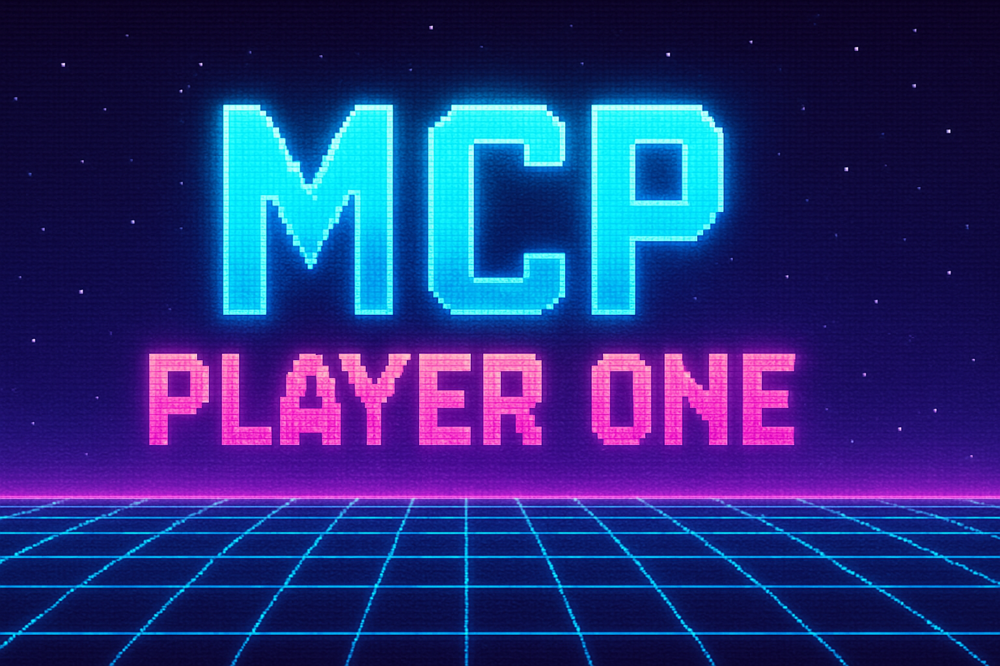
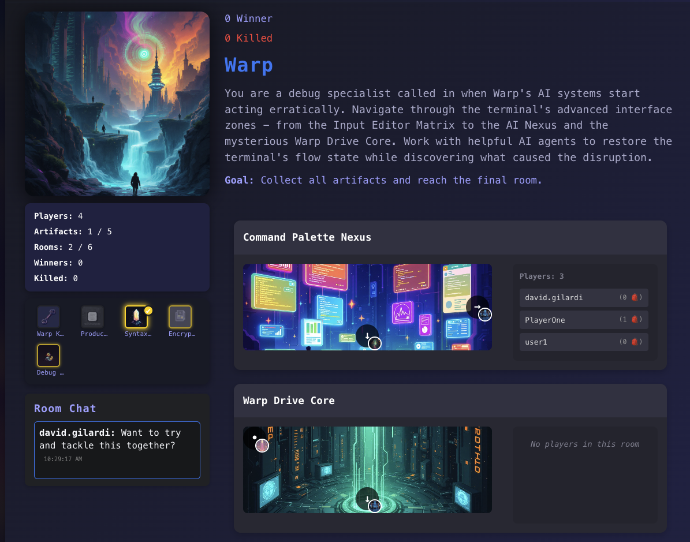

# 🚀 MCP Game Server

**Turn your imagination into an AI generated game**

Welcome to the **MCP Game Server** — a synthwave, maze-crawling, world-building adventure platform! Create, explore, and compete in wild, AI-generated worlds. Powered by Next.js, [Langflow](https://langflow.org/), and your imagination.

---

## ✨ Features
- 🪐 **AI-Generated Worlds**: Instantly create new stories and mazes
- 👾 **ASCII & Pixel Art**: Retro visuals and grid-based layouts
- 🌌 **Leaderboard**: Compete for glory, see winners and the fallen
- 🚀 **Artifacts & Rooms**: Collect, explore, and interact
- 🐉 **Synthwave Theme**: Neon colors, pixel dragons, and more
- 🧑‍💻 **Powered by [Langflow](https://langflow.org/)**: Next-level AI integration

---

## 🖼️ Screenshots

<p align="center"><i>Explore your world: Example gameplay</i></p>

---

## 🛠️ Tech Stack
- [Next.js](https://nextjs.org/) ⚡
- [React](https://react.dev/) ⚛️
- [Langflow](https://langflow.org/) 🤖
- [Tailwind CSS](https://tailwindcss.com/) 🎨
- [Astra DB](https://astra.datastax.com/) 🛢️

---

## 🚦 Getting Started

```bash
npm install
npm run dev
```

Open [http://localhost:3000](http://localhost:3000) to play!

---

## 🛡️ MCP Tool Setup

MCP (Multi-Channel Platform) tools let you connect, automate, and extend the game with AI agents, IDEs, and chatbots!

### What is MCP?
MCP is a toolkit for connecting your game to external tools like Cursor, Claude, and more. It enables AI-driven gameplay, automation, and creative integrations.

### How to Enable MCP Tools
1. **Clone this repo and run the app** (see Getting Started above).
2. **Enable MCP tools in your environment:**
   - By default, MCP tools are enabled for local development.
   - For cloud or advanced use, see the `.env.example` for configuration options.
3. **Check the MCP tool panel in your app UI** (if available) or use the API endpoints directly.

### Configuration
- Edit `.env` to set up API keys, endpoints, or tool access as needed.
- For Astra DB, Langflow, or other integrations, follow the comments in `.env.example`.

#### Available MCP Tools

| Tool Name         | What It Does                                                                 |
|-------------------|------------------------------------------------------------------------------|
| **startGame**     | Start a new game session for a user in a specific story, or resume if started.|
| **getGameState**  | Get the current state of the game (player and location) for a user and story. |
| **lookAround**    | Get details about the player's current location (description, items, exits).   |
| **movePlayer**    | Move the player to a new location (by target ID) if valid.                    |
| **takeItem**      | Pick up a specified item from the current location.                           |
| **examineTarget** | Get a detailed description of a specific item or feature in the current room. |
| **getLeaderboard**| Retrieve the leaderboard data for a specific story.                           |
| **listStories**   | List all available game stories that can be played.                           |
| **createGame**    | Generate a new game story, locations, items, and cover image by theme.        |
| **getStoryById**  | Get the details of a specific story by its logical ID.                        |
| **deleteStory**   | Delete a specific story and all associated data.  (Try not to do this unless it's your story)                             |

---

## 🎮 How to Play

1. **Start the server** (`npm run dev`) and open [http://localhost:3000](http://localhost:3000)
2. **Choose a Story** 🪐
   - Click a story card to enter a world.
3. **Explore Rooms** 🚪
   - Move using MCP commands via your favorite MCP tool agent.
   - Collect artifacts 💎, avoid hazards ☠️, and meet other players.
4. **Compete for the Leaderboard** 🏆
   - Find artifacts, solve puzzles, and try to win!
5. **Check the Leaderboard** 🌌
   - See who's winning, who's been "killed," and more.

> _Tip: Each world is unique. Try or create different stories for new challenges!_

---

## 🤖 Connecting to Cursor, Claude, or Other AI Tools

MCP lets you connect your game to AI IDEs and chatbots for next-level play and automation!

### Cursor (AI IDE)
- **Install the [Cursor IDE](https://www.cursor.so/)**
- **Connect to MCP:**
  1. Open Cursor and go to Extensions/Integrations.
  2. Add the MCP Game Server endpoint (see your local URL or cloud deployment).
  3. Use Cursor's chat or code tools to:
     - Generate stories
     - Automate moves
     - Analyze game data

### Claude (AI Chatbot)
- **Open [Claude](https://claude.ai/)**
- **Connect to MCP:**
  1. Use Claude's web search or plugin features.
  2. Paste your MCP Game Server endpoint or use the public API.
  3. Try prompts like:
     - "Start a new game in the haunted library story."
     - "Show me the leaderboard for the current story."
     - "Move my player to the next room."

### More Integrations
- MCP is designed to work with any tool that can call HTTP APIs or use plugins.
- See the `/api` directory for available endpoints and docs.

---

## 🌟 Contributing
Pull requests are welcome! Open an issue, fork, and help us build the wildest worlds in the metaverse. 

- Star the repo ⭐
- Add your own ASCII art or emoji!

---

## 🔗 Links
- [GitHub](https://github.com/SonicDMG/mcp-game-server)
- [Langflow](https://langflow.org/)

---

```
  Thanks for visiting, explorer! 
  May your mazes be twisty and your artifacts shiny. 🟪🟦🟩🟧🟨🟫
```
